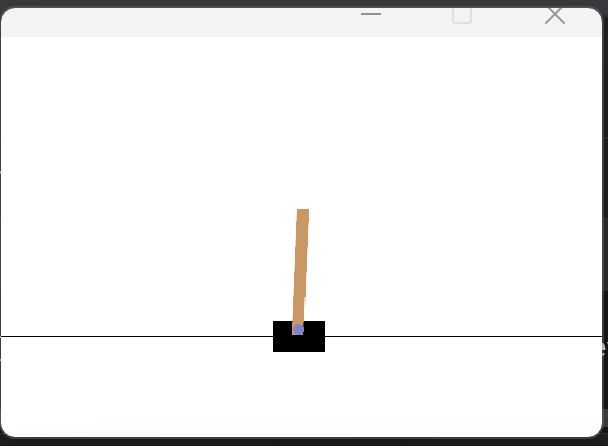
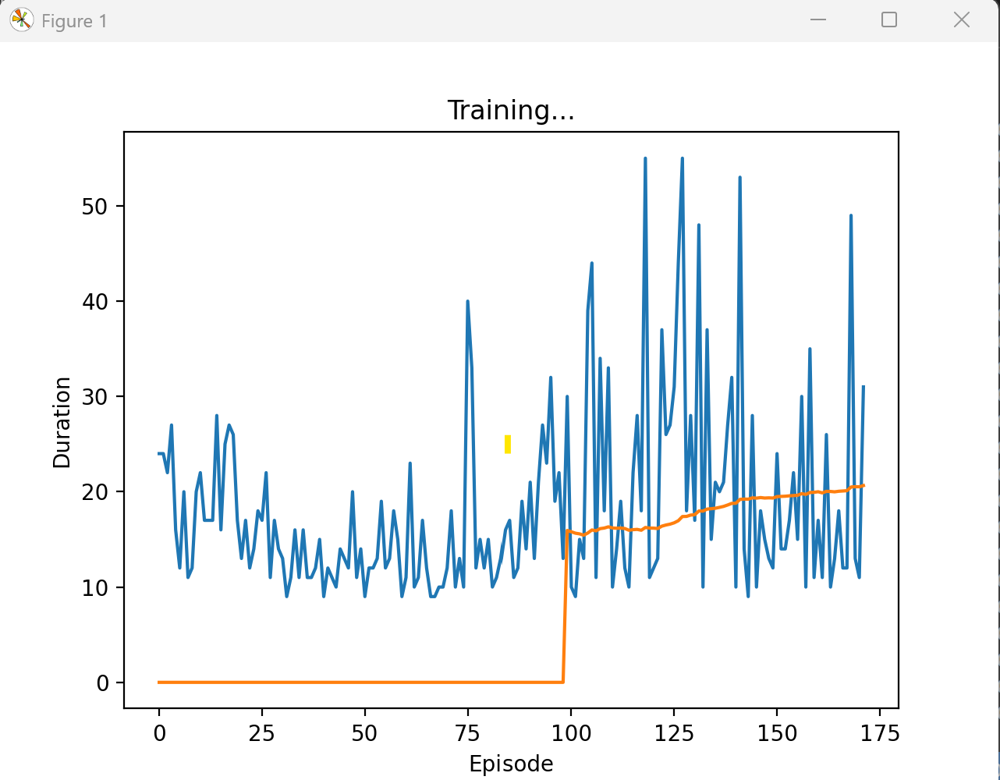

# Deep Q-Network (DQN) Implementation on CartPole-v1

This project demonstrates the application of a **Deep Q-Network (DQN)** to the classical control problem **CartPole-v1**, based on the official [PyTorch reinforcement learning tutorial](https://pytorch.org/tutorials/intermediate/reinforcement_q_learning.html).

---

## 🧠 Problem Overview

The CartPole problem involves balancing a pole on a cart by applying forces to the left or right. The agent receives a reward of +1 for each timestep the pole remains upright. The episode ends when the pole falls or the agent reaches 500 steps.

---

## 📂 Project Structure

```

ReinforcmentDeepLearning/
│
├── images/
│   ├── cartpole\_dqn\_v1.png         # Episode duration plot
│   └── dqn\_agent\_in\_action.png     # Rendered frame of agent behavior
│
├── reinforcmentDL.py               # Main training script
└── README.md

````

---

## 📸 Visual Outputs

**Agent Interaction**  
<p align="center">
  
</p>

**Training Progress**  
<p align="center">
  
</p>

---

## 🔬 DQN Algorithm Highlights

- Q-function is approximated using a deep neural network
- Experience replay buffer (ReplayMemory) improves sample efficiency
- A target network is used to stabilize learning
- Epsilon-greedy action selection strategy
- Smooth L1 Loss (`Huber loss`) is used to reduce sensitivity to outliers

---

## ⚙️ Key Hyperparameters

| Name               | Value     |
|--------------------|-----------|
| Batch Size         | 128       |
| Learning Rate      | 1e-4      |
| Gamma (Discount)   | 0.99      |
| Epsilon Start      | 0.9       |
| Epsilon End        | 0.05      |
| Epsilon Decay      | 1000      |
| Tau (Target Update)| 0.005     |
| Replay Memory Size | 10,000    |
| Episodes           | 250       |

---

## 🛠️ Setup & Usage

Install requirements:

```bash
pip install gymnasium[classic-control]
pip install torch matplotlib ipython
````

Run the training script:

```bash
python reinforcmentDL.py
```

---

## 📚 References

* **[PyTorch Official DQN Tutorial](https://pytorch.org/tutorials/intermediate/reinforcement_q_learning.html)**
  This repository is primarily based on this tutorial, with additional visualization and tweaks.

* Mnih, V. et al. (2015). *Human-level control through deep reinforcement learning*. Nature.

---

## 👩‍💻 Author

Developed by **Esra** as part of a hands-on exploration in deep reinforcement learning using PyTorch and Gymnasium.

---

## 📌 Notes

* Ensure `render_mode="human"` works with your system (requires `pygame`)
* For video capture or headless environments, consider using `render_mode="rgb_array"`

---

